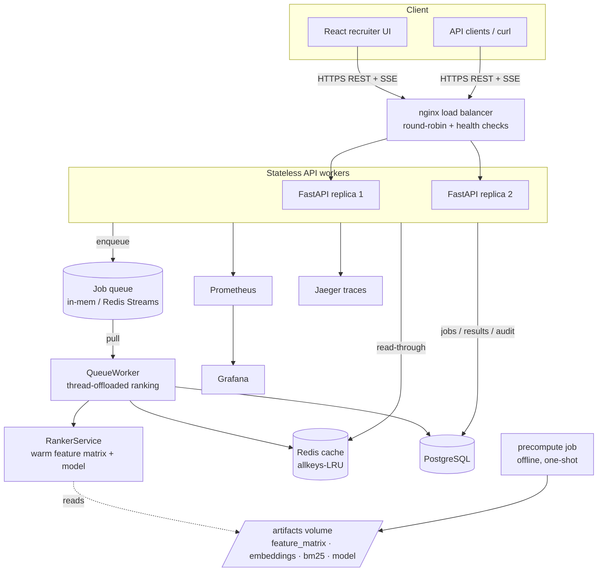

# System Design

This is the map between system-design concepts and where they actually live in
this repo. Each item is tagged **[built]** (implemented and tested here) or
**[scale-path]** (designed, the next step when load demands it). It doubles as
the script for defending the architecture.

---

## 1. Big picture



Two phases, one hard rule: **the ranking step is offline, CPU-only, ≤5 min.**
Everything expensive (LLM calls, embedding 100K profiles, BM25 build, model
training) happens once in `precompute.py`; the online path only reads artifacts.

---

## 2. Core components

| Component | Where | Notes |
|---|---|---|
| Client apps | `frontend/` (React) + any REST client | JWT or API-key auth |
| Backend servers | `api/` FastAPI, run as 2 uvicorn replicas | stateless, 12-factor |
| Database | `db/` SQLAlchemy -> Postgres (prod) / SQLite (dev) | jobs, results, users, api_keys, audit |
| Load balancer | `deploy/nginx/nginx.conf` | round-robin + passive health checks |
| Message queue | `services/queue.py` | in-memory or Redis Streams |
| Cache | `services/cache.py` | Redis or in-process LRU/LFU |
| Monitoring & logs | `api/metrics.py`, `core/logging.py`, `core/tracing.py` | Prometheus + structlog + OTel |

---

## 3. Data-intensive vs compute-intensive

Both, in different phases - which is exactly why they're split.

- **Compute-intensive: the ranking step.** numpy/pandas vectorised scoring over
  100K rows, an XGBoost predict, a 100K×384 cosine pass. CPU-bound, GIL-bound,
  ~110 ms warm. Scaling lever = cores / replicas / worker fleet. *(Like the
  ranking tier of a search system, or ML inference - throughput is set by
  compute, not IO.)*
- **Data-intensive: the feature store + artifacts.** A 46 MB feature matrix,
  153 MB embeddings, a 61 MB BM25 index, ~480 MB source file. IO- and
  memory-bound; the lever is layout (mmap, columnar) and a shared store. *(Like
  the offline feature pipeline behind a recommender.)*

`precompute.py` is the data-intensive batch job; `services/ranker.py` is the
compute-intensive serving path. Keeping them in separate containers (bulkhead)
means a heavy reindex never steals CPU from live requests.

---

## 4. Functional vs non-functional requirements

**Functional [built]:** auth + API keys; submit a ranking job (released JD,
custom JD, or ad-hoc sample); live progress; ranked top-100 with reasoning; CSV
download; job history; admin reindex + audit.

**Non-functional:**

| Quality | How |
|---|---|
| Scalability | stateless workers behind nginx; queue decouples submit from compute; **[scale-path]** worker fleet + read replicas |
| Availability | health/readiness probes, graceful degradation, cache falls back to memory, ranker boots "not ready" instead of crashing |
| Reliability | retries + dead-letter queue, idempotent consumer, circuit breaker on the one LLM call |
| Performance | warm ranker ~110 ms; read-through cache; precompute moves cost offline |
| Security | bcrypt passwords, hashed API keys, JWT, RBAC, per-identity rate limit, no secrets in code |
| Maintainability | typed config/exceptions, repository pattern, ruff+mypy, tests, migrations |
| Observability | structured logs + metrics + traces + request IDs |

---

## 5. APIs & communication

**REST [built]** - `api/routers/*`. Correct verbs and codes: `POST /rank`
(202 Accepted, write path), `GET /rank/{id}` (200), `GET /rank/{id}/results`
(read path), `DELETE /auth/api-keys/{id}` (204), 401/403/404/409/422/429 mapped
from typed exceptions in `core/exceptions.py`. Pagination/filters are query
params; bodies are JSON validated by pydantic.

**SSE [built]** - `GET /rank/{id}/stream` pushes live job progress (a
lightweight one-way alternative to WebSockets; perfect for progress).

**[scale-path] when to reach for the others:**
- **gRPC** - internal API->ranking-worker calls at high QPS (binary, multiplexed,
  lower serialization cost than JSON). The natural cut once ranking moves to its
  own fleet.
- **GraphQL** - if the UI needs to assemble many candidate sub-resources per
  view and we want to avoid over/under-fetching.
- **WebSockets** - only if we need bidirectional/interactive streaming; SSE
  covers our one-way progress need.
- **SOAP** - not used; no enterprise XML contract requirement.

---

## 6. SQL data model

`db/models.py`. UUID string PKs, portable JSON columns (run on SQLite and
Postgres unchanged).

```
users (1) ───< (N) api_keys          one-to-many, FK api_keys.owner_id -> users.id
job_runs (1) ─< (N) ranking_results   one-to-many, FK results.job_id -> job_runs.id
audit_log                              append-only event trail
```

- **Constraints:** unique `users.email`, unique `api_keys.key_hash`, FKs with
  `ON DELETE CASCADE`.
- **Joins:** `get_results` joins a job to its 100 result rows (indexed on
  `(job_id, rank)`); the UI's history view joins jobs to their creators.
- **Migrations:** Alembic (`alembic/`), autogenerated, `alembic upgrade head`.

---

## 7. Caching

`services/cache.py`.

- **Read-through [built]:** on a ranking request the worker checks the cache
  keyed by `hash(JD + candidate set + top_k)`; miss -> compute -> populate. A
  repeat request is a **cache hit** and skips ranking entirely.
- **TTL [built]:** entries expire after `CACHE_TTL_SECONDS` (1h default).
- **Eviction [built]:** bounded capacity with **LRU** (default, matches Redis
  `allkeys-lru` in the compose file) or **LFU**; FIFO available. Counts
  evictions for metrics.
- **Write policies (where each fits):**
  - *write-through* - job results are written to Postgres and cache together on
    completion (what we do: durable + warm).
  - *write-around* - large one-off artifacts bypass the cache (we don't cache
    embeddings; they're mmap'd).
  - *write-back* - **[scale-path]** for high-write counters (e.g. rate-limit
    tallies) batch-flushed to the DB; we currently keep those in Redis only.

---

## 8. Load balancing

`deploy/nginx/nginx.conf`.

- **Round-robin [built]** across two API replicas; **passive health checks**
  (`max_fails`/`fail_timeout`) eject a bad replica; `proxy_next_upstream`
  retries the other on 502/503.
- **Switchable strategies** (one line in the upstream): **least-conn** (favor
  the idlest replica - good when rank latency varies), **ip-hash** (sticky
  sessions), **weighted** (give a bigger box more traffic).
- **[scale-path]** GEO-based routing via a global LB / Anycast when multi-region.

---

## 9. Replication  *(scale-path)*

- **Postgres single-leader** with async read replicas. Writes (job creation,
  results) -> primary; the read path (`GET /results`, history, admin) -> replicas.
  This pairs with the CQRS split already in the routers.
- **Sync vs async:** async replication for throughput; accept slight read lag on
  history (a just-finished job reads from primary until it propagates).
- **Redis replication + Sentinel** for cache/queue HA.
- **Quorum** reads/writes are overkill here; the data is recomputable, so we
  favor availability.

## 10. Partitioning / sharding  *(scale-path)*

- **Candidate pool by hash** of `candidate_id` across N shards; each ranking
  worker owns a shard's feature slice and returns local top-K, merged by a
  coordinator (scatter-gather, the same shape as retrieval's RRF). This is the
  answer to the "feature matrix replicated per worker" bottleneck.
- **Results/jobs by time** (monthly partitions on `created_at`) so history
  queries hit one partition and old data is cheap to drop.
- **Secondary-index partitioning** for "find a candidate across shards" via a
  global id->shard map.
- **Hotspots:** a single very popular JD would hammer one cache key - mitigated
  by request coalescing + the read-through cache.

---

## 11. CAP theorem

Two pieces of state, two deliberate choices:

- **Feature matrix / artifacts -> Consistency over Availability.** A missing or
  checksum-mismatched artifact makes the ranker refuse to serve (boots "not
  ready") rather than rank on half-written features. A correct answer late beats
  a wrong one now.
- **Cache & queue -> Availability over Consistency.** Redis down -> cache falls
  back to in-memory and the queue to in-process; we keep serving (possibly
  recomputing) instead of erroring. Partition tolerance is a given in a
  multi-node deployment, so each store picks its side of C vs A.

---

## 12. Message queue

`services/queue.py` + `services/jobs.py`.

- **Async processing [built]:** `POST /rank` enqueues and returns 202; a
  `QueueWorker` pulls and runs the job. Submit is decoupled from compute.
- **Priority + FIFO [built]:** interactive sandbox samples (priority 3) jump
  ahead of full-pool jobs (priority 5); ties are FIFO.
- **Push vs pull [built]:** producers push (`enqueue`); the worker pulls when it
  has capacity (bounded by a semaphore) - natural backpressure.
- **Pub/Sub [built]:** job progress is published to in-process channels the SSE
  endpoint subscribes to. **[scale-path]** swap for Redis pub/sub so any replica
  can stream a job running on any other.
- **Poison messages [built]:** a handler that keeps failing is retried up to
  `max_attempts`, then dead-lettered (and the job marked failed) instead of
  looping forever.
- **Duplicate messages [built]:** the consumer is idempotent (skips a job that's
  already finished) and the queue supports a dedup key - so at-least-once
  delivery is safe.
- **[scale-path]** the `RedisStreamQueue` backend (consumer groups + DLQ stream)
  is the multi-node, restart-surviving version of the same interface.

---

## 13. Fault tolerance

- **Hardware/instance failure:** stateless replicas; nginx reroutes; k8s/compose
  restarts; readiness gates traffic.
- **Software failure:** typed exceptions -> clean HTTP; unhandled errors caught
  by a global handler; retries + DLQ for jobs.
- **Dependency failure:** circuit breaker on the LLM JD call (falls back to a
  hardcoded JobSpec); cache/queue degrade to in-memory; missing model -> proxy
  formula; missing embeddings -> BM25-only.
- **Human error:** Alembic migrations are reviewable + reversible; audit log
  records who did what; admin actions are RBAC-gated.

---

## 14. Monitoring & observability

`api/metrics.py`, `api/middleware.py`, `core/logging.py`, `core/tracing.py`.

- **Throughput / latency / error rate:** `http_requests_total`,
  `http_request_duration_seconds` (histogram, by route template),
  `ranking_latency_seconds`. Grafana dashboard in `deploy/grafana`.
- **Domain metrics:** `ranking_requests_total{source,cache_hit}`,
  `gate_filter_exclusions_total{reason}`, `honeypot_detected_total`,
  `cache_events_total`.
- **Health checks:** `/health/live` (process up), `/health/ready` (ranker + DB +
  cache).
- **Logs:** one JSON object per event with `request_id` and `trace_id` for
  correlation.
- **Traces:** OpenTelemetry spans (gate -> retrieval -> ML -> loop) to Jaeger;
  no-ops cleanly when OTel isn't installed.
- **Resource metrics (CPU/mem/disk/net):** standard process exporters in the
  compose stack pipe to Prometheus.

---

## 15. Known bottlenecks & the scale path

Worst-first (with measured numbers):

1. **CPU-bound rank throughput** (~110 ms warm, GIL-serialized) -> queue-fed
   ranking-worker fleet + more cores. *(addressed by `services/queue.py`)*
2. **Feature matrix replicated per worker** (~100-150 MB each) -> shared feature
   store / sharded pool (§10) + Arrow/Parquet mmap.
3. **Cache-miss path** (unique JDs pay full compute) -> ANN index + request
   coalescing.
4. **Precompute embedding** (tens of min with ST on CPU) -> GPU batch /
   incremental embedding of only changed candidates.
5. **Retrieval O(N) scan** at millions -> FAISS/HNSW + sharded BM25.
6. **DB write path** -> read replicas + time partitioning.
7. **In-process SSE pub/sub** -> Redis pub/sub for cross-replica streaming.

---

## 16. Request lifecycle (DNS -> response)

1. **DNS** resolves the API hostname (recursive resolver -> root -> TLD ->
   authoritative name server) to the load balancer's IP.
2. **nginx** terminates TLS, picks a healthy replica (round-robin).
3. **Middleware** assigns a `request_id`, starts a timer/span.
4. **Auth** (JWT or API key) + **rate limit** dependencies run.
5. **Router** validates the body (pydantic), creates the job row (commits), and
   **enqueues** a message -> returns **202** with a job id and stream URL.
6. **Worker** pulls the message, checks the **cache**, runs the **ranker**
   off-thread, writes **results + audit** to Postgres, publishes **completed**.
7. Client reads `GET /results` (or follows the **SSE** stream) and downloads the
   **CSV**. Metrics and a trace are emitted throughout.
